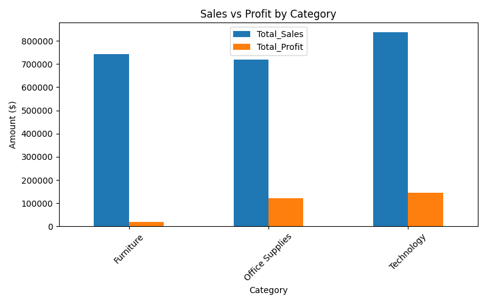

# Business Performance Analysis & Automated Reporting Tool

## Project Overview
This project automates the cleaning, analysis, and reporting of business performance data from a retail sales dataset.  
It is designed to generate actionable insights for decision-making and demonstrate end-to-end analytical skills.

---

## Business Problem
Many businesses struggle to identify which product categories or customer segments generate high revenue but underperform in profitability.  
This project addresses the question:  

**"Which product categories contribute significantly to revenue but show low profit margins, and what actions can be recommended?"**

---

## Dataset
- Source: Superstore Sales Dataset (Retail)
- Key Columns:
  - `Order Date`, `Category`, `Sub-Category`, `Segment`, `Region`
  - `Sales`, `Profit`, `Quantity`, `Discount`

---

## Tools & Technologies
- Python (`pandas`, `matplotlib`, `openpyxl`)
- Excel (for automated reporting and dashboards)

---

## Methodology
1. **Data Cleaning**
   - Handled missing values and duplicates
   - Ensured numeric columns were correctly formatted

2. **Data Analysis**
   - Calculated KPIs: Total Sales, Total Profit, Profit Margin, Average Order Value
   - Grouped data by Category and Segment to identify performance patterns
   - Generated visualizations for better understanding

3. **Automated Reporting**
   - Script outputs Excel workbook with:
     - **Sheet 1: KPI_Summary** – Summary of KPIs and overall metrics
     - **Sheet 2: CleanedData** – Processed and validated dataset
     - **Sheet 3: Category_Analysis** – Revenue, profit, and performance analysis by product category

---

## Key Insight
- The **Technology category** contributes ~35% of total revenue but only ~12% of total profit.  
- Indicates a mismatch between revenue generation and profitability.

---

## Recommendation
- Review pricing and discount strategies for Technology products to improve profitability.  
- Focus marketing and promotions on high-margin categories to maximize profit efficiency.

---

## Learning Outcomes
- Translating a business problem into analytical tasks
- KPI identification and validation
- Data cleaning, processing, and automated reporting
- Generating actionable business insights from raw data
- Communicating findings effectively to stakeholders

---

## How to Run
1. Clone the repository
2. Ensure `pandas`, `matplotlib`, and `openpyxl` are installed
3. Place the `Superstore Sales` CSV in the project directory
4. Run `report_generator.py`
5. Output Excel file `Business_Report.xlsx` will be generated with three sheets:  
   - **KPI_Summary**  
   - **CleanedData**  
   - **Category_Analysis**

---

## Deliverables
- Python Script: `report_generator.py`
- Output Excel Report: `Business_Report.xlsx`
- Dataset: `Superstore_Sales.csv`
- Documentation: `README.md`
- 
## Category Analysis

The chart below shows revenue vs profit for each product category:

